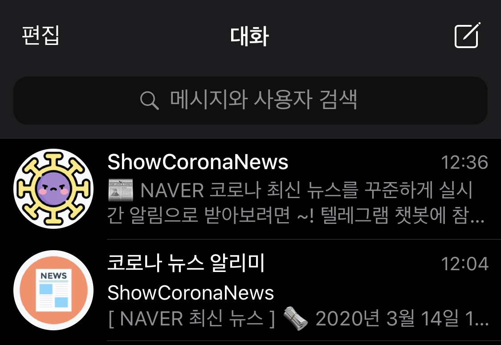

# 👾 Covid-19 코로나 관련 최신 정보 알림 챗봇
질병관리본부의 코로나 데이터, 네이버 RSS 뉴스 데이터, 공적마스크 판매처 위치 & 재고 현황 데이터를 이용한 코로나 텔레그램 챗봇

## 코로나 챗봇 기능

### 👨🏻‍💻 1. ShowCoronaNews 챗봇 기능 !
여러 커맨드를 입력해 코로나 확진자 데이터, 네이버의 실시간 뉴스, 공적마스크 판매처 위치 & 재고 정보 등 원하는 정보를 직접 조회 할 수 있습니다 !

### 📬 2. 코로나 뉴스 알리미 그룹  (구독) !
매일 오전 11시에 국내 코로나 확진자 수 알림과 매일 11시~19시 사이 1시간마다 네이버 실시간 코로나 뉴스를 주기적으로 주는 알리미 :)

## 💻 챗봇을 로컬 환경에서 실행해보기
### 의존성 모듈 설치
```
pip3 install -r requirements.txt 
```
챗봇을 사용하기 위해 필요한 모듈들을 설치해줍니다.

### 환경 변수 설정
```
config.py 파일에 텔레그램을 생성해서 발급 받은 Token을 대입
```
Token은 텔레그램의 `@BotFather` 챗봇을 통해서 쉽게 생성할 수 있습니다.

### 챗봇 서버 실행하기
```
python3 app.py
```
실행 이후 자신이 생성한 챗봇에 메시지를 보내봅니다 :)

### 선택 사항) 그룹 / 채널로 공지 메시지를 보내는 법
1. 텔레그램 대화 탭으로 이동합니다.
2. 메시지 추가 아이콘 클릭합니다.
3. 그룹/채널을 생성한 후 만들었던 개인 챗봇을 초대합니다.
4. 챗봇을 관리자로 승격시킨 후 링크 공유로 그룹 아이디 생성 
    > (`'t.me/'` 이후 문자가 그룹 아이디)
5. telegram_notify.py 파일에 생성한 그룹 아이디를 대입해줍니다.
    > bot.sendMessage('@그룹아이디', ...)
6. 동일 디렉터리에 아무 파일을 생성한 후 telegram_notify를 import해서 그룹/채널에 메시지 테스트 해보면 끝 !

## 🎮 실행 화면
제공되는 챗봇은 2가지 입니다.



아래 링크를 클릭해서 실행 화면을 확인하세요.
### 1. [챗봇 정보 & 간단한 설명 보기](https://github.com/wwlee94/telegram-chatbot-covid19/blob/master/introduction/README.md)

### 2. [*ShowCoronaNews* 챗봇 화면 보기](https://github.com/wwlee94/telegram-chatbot-covid19/blob/master/introduction/show_corona_news/README.md)

### 3. [*코로나 뉴스 알리미* 그룹 챗봇 화면 보기](https://github.com/wwlee94/telegram-chatbot-covid19/tree/master/introduction/show_corona_group/README.md)

## 💸 서버 배포 & 잡 스케줄링
1. *ShowCoronaNews* 챗봇 서버는 Heroku에 서버 App 생성 후 배포
2. *코로나 뉴스 알리미* 는 Github Actions (CI/CD) 사용하여 스케줄링 잡 생성
> 비용 때문에 더 이상 서버로 제공되지 않습니다.

## 🌏 개발할 때 참고한 사이트
* [네이버 뉴스](https://www.naver.com)
* [질병관리본부 - 코로나 발생동향](http://ncov.mohw.go.kr)
* [공적 마스크 API](https://app.swaggerhub.com/apis-docs/Promptech/public-mask-info/20200307-oas3#/)
* [텔레그램 챗봇 API](https://core.telegram.org/bots)
* [챗봇 생성 및 초기 설정](https://blog.psangwoo.com/coding/2016/12/08/python-telegram-bot-1.html)
