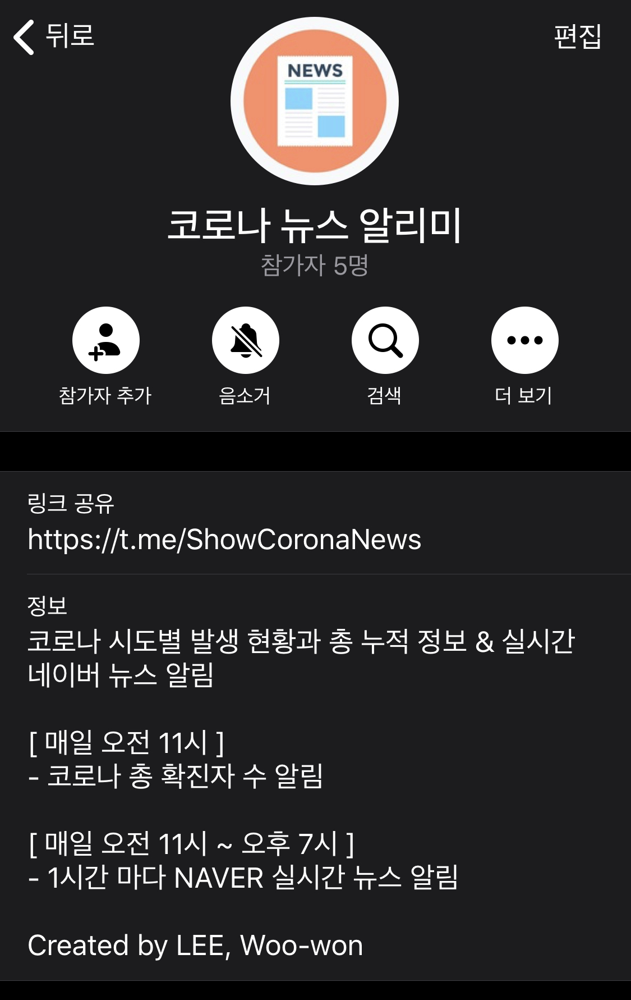

## [*ShowCoronaNews* 챗봇](https://github.com/wwlee94/telegram-chatbot-covid19/blob/master/introduction/show_corona_news/README.md)
여러 커맨드를 입력해 코로나 확진자 데이터, 네이버의 실시간 뉴스, 공적마스크 판매처 위치 & 재고 정보 등 원하는 정보를 직접 조회 할 수 있는 챗봇입니다.

## [*코로나 뉴스 알리미* 그룹 챗봇](https://github.com/wwlee94/telegram-chatbot-covid19/tree/master/introduction/show_corona_group/README.md)
매일 오전 11시에 국내 코로나 확진자 수 알림과 매일 11시~19시 사이 1시간마다 네이버 실시간 코로나 뉴스를 주기적으로 받을 수 있는 챗봇입니다.

