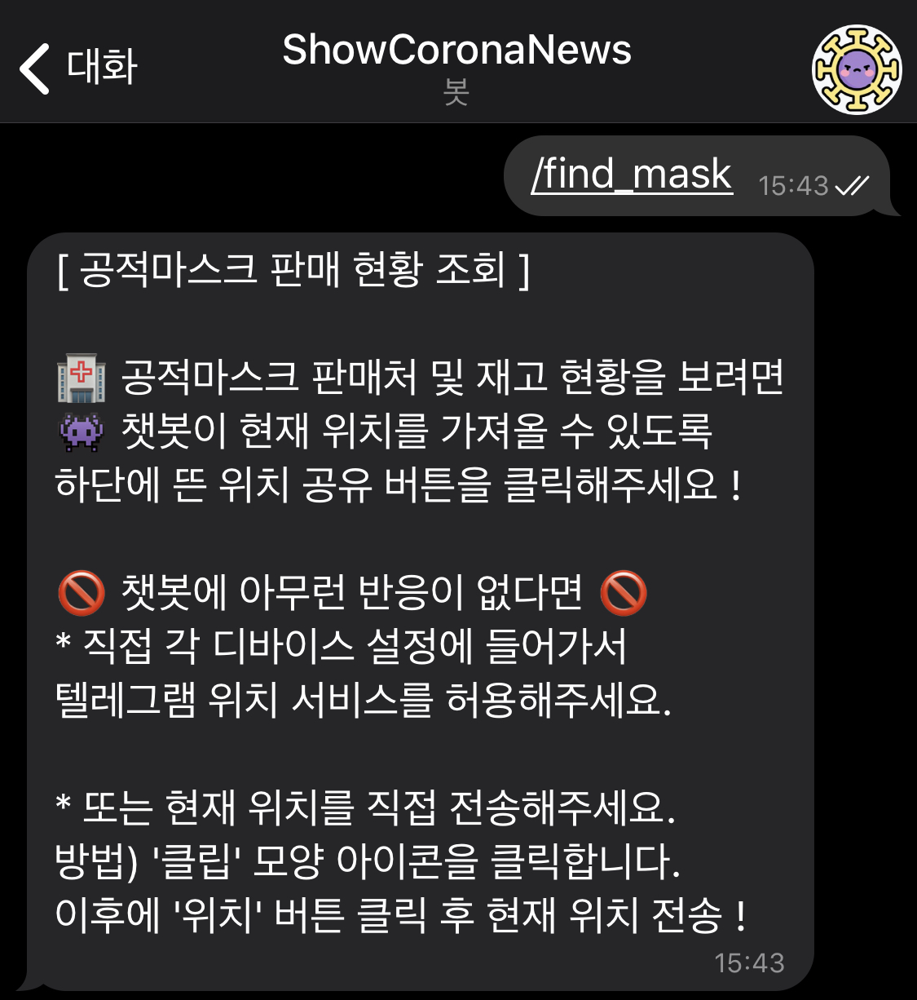
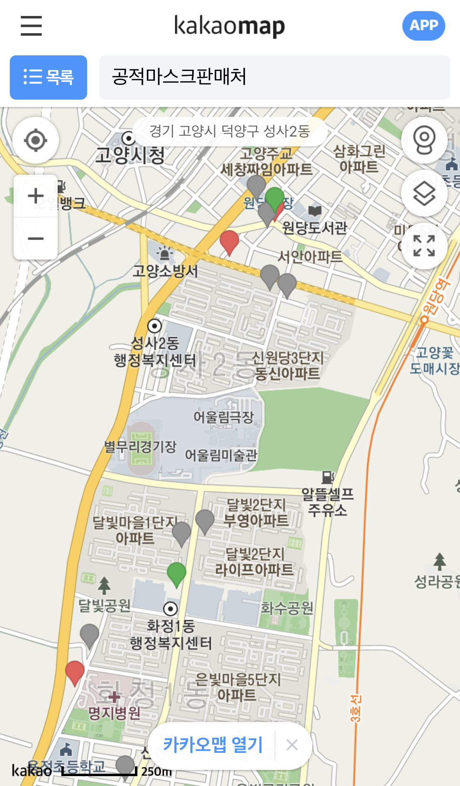
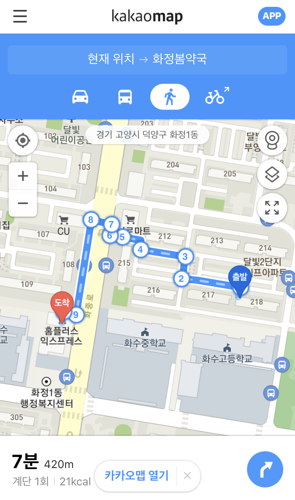

# *ShowCoronaNews* 챗봇

## *ShowCoronaNews* 챗봇의 커맨드 (명령어 종류)
총 7가지 커맨드가 있습니다.

## /start & /help 커맨드
챗봇의 시작말, 정보 & 커맨드 종류를 알려줍니다.

## /total & /citylines 커맨드
현재 국내의 총 확진자 수 & 시도별 확진자 수를 확인 할 수 있습니다.

## /naver_news 커맨드
NAVER RSS 데이터를 이용해 실시간으로 올라오는 네이버 뉴스를 바로 확인 할 수 있습니다.

## /notify 커맨드
*코로나 뉴스 알리미* 그룹 챗봇의 기능, 정보와 링크를 알려줍니다.

## /find_mask 커맨드
현재 위치 기반으로 근처 모든 판매처 위치와 재고 현황을 확인 할 수도 있고 챗봇이 추천 판매처 정보를 알려줍니다.  
추천 판매처는 500m이내 가깝고 재고가 많은 순서대로 2가지 판매처를 추천해줍니다.  
1. */find_mask* 커맨드를 입력

2. 현재 위치를 봇에게 공유

3. 마스크 정보 설명 및 주변 모든 판매처 확인 가능

* 주변 모든 판매처 링크 클릭
주변의 모든 판매처 위치와 색깔에 따라 재고 현황 확인 가능

4. 추천 판매처 정보 확인 가능

* 추천 판매처 링크 클릭시
현재 위치에서 판매처까지 길찾기 기능으로 바로 커넥트

